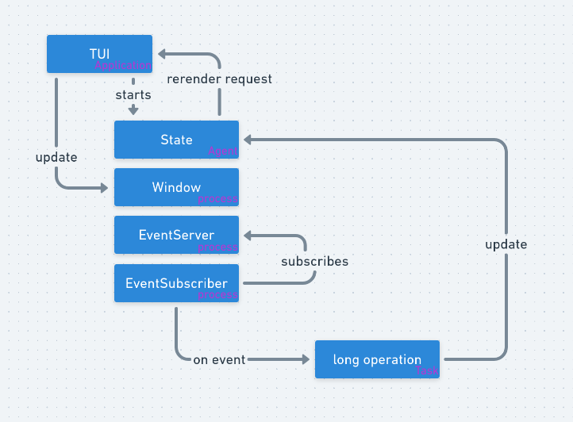

## What it is :
This Proof of Concept demonstrates how an elixir terminal application can :
* offer a TUI which does not require the user to issue commands
* perform async request (like an http query) whitout freezing user navigation



## What I had in mind :
* Getting deeper knowledge about how elixir processes work and communicate
* Trying out a TUI lib

## How to try it out :
```bash
# /!\ Install elixir if you don't have it
# Get the project
git clone https://github.com/NoBrainSkull/poc-async-tui
cd poc-async-tui
mix deps.get

# Launch the main app. We are giving the app process a name.
elixir --sname app -S mix run --no-halt

# Repl into it by linking an iex process into the application
iex --remsh app --sname repl
```

## Once the app is open
1. Press 'a', an async task will fetch some keys from aws (you need to have orkestra profile)
2. Press 'e', a fake error raised from an async task (as if a had failed) will be simply treated
3. Press 'q', it will exit the app

## There are a lot of comments in the code
I tried very hard to explain how I currently see things and how all components works together. Here is
a representation of interactions in the app :


## You can repl into the app and mess with inner components if you want !
```bash
# Repl into the app by linking an iex process to it
iex --remsh app --sname repl
```

## Upgrade ideas
* Exiting only close the window, the app process need to be killed
* Use an example which don't need orkestra profile
* Introduce supervision to better handle actions failures
* Introduce a better state management in a reframe-like fashion
